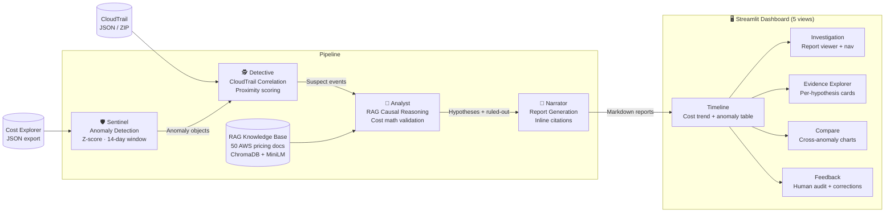

# 🔍 CostSherlock
> An agentic system for causal attribution of AWS cost anomalies

CostSherlock is a four-agent AI pipeline that automatically investigates unexpected spikes in your AWS bill, traces them to specific CloudTrail events, and produces evidence-backed explanation reports — all without requiring manual log analysis. It is designed for cloud engineers and FinOps practitioners who need to answer "why did our bill jump last Tuesday?" in minutes rather than hours, and for engineering teams that want an auditable, citation-grounded record of every cost incident.

🌐 **[Live Demo — Streamlit Cloud](https://costsherlock.streamlit.app)** &nbsp;|&nbsp; 📄 **[Project Site — GitHub Pages](https://naik-vatsal.github.io/costsherlock/)**

---

## Architecture



---

## Quick Start

### Demo Mode (no AWS account needed)

```bash
git clone https://github.com/naik-vatsal/costsherlock.git
cd costsherlock

python -m venv venv
source venv/bin/activate        # Windows: venv\Scripts\activate
pip install -r requirements.txt

# Add your Anthropic API key
echo "ANTHROPIC_API_KEY=sk-ant-..." > .env

# Run the full pipeline on bundled synthetic data (prints a report)
python demo.py

# Launch the interactive dashboard
streamlit run dashboard/app.py
```

The dashboard opens at `http://localhost:8501`. Click **Load Demo Data** in the sidebar to explore eight pre-loaded anomalies across seven AWS services.

### With Your Own AWS Data

**1. Export Cost Explorer data** (AWS Console → Cost Explorer → Download as CSV, or via CLI):

```bash
aws ce get-cost-and-usage \
  --time-period Start=2026-01-01,End=2026-02-28 \
  --granularity DAILY \
  --metrics BlendedCost \
  --group-by Type=DIMENSION,Key=SERVICE \
  --output json > data/cost_exports/my_costs.json
```

**2. Export CloudTrail events** (AWS Console → CloudTrail → Event history → Download JSON, or place files in the directory):

```bash
# Place one or more CloudTrail JSON files in:
data/cloudtrail/
```

**3. Run the pipeline:**

```bash
python pipeline.py \
  --cost data/cost_exports/my_costs.json \
  --logs data/cloudtrail/
```

**4. Or use the dashboard upload flow** — both cost JSON and CloudTrail logs (JSON or ZIP) can be uploaded directly in the sidebar. No CLI required.

---

## How It Works

**Sentinel** reads your AWS Cost Explorer export and applies a z-score anomaly detector with a 14-day rolling window (threshold: z ≥ 2.5). Each day's spend per service is compared against the recent baseline; dates that deviate significantly are flagged as `Anomaly` objects and passed downstream. This stage is fully deterministic — no LLM calls.

**Detective** loads your CloudTrail JSON exports and scores every event against each anomaly using a proximity function that weighs temporal closeness and event type. Only events on a curated mutating-event whitelist (e.g. `RunInstances`, `PutBucketLifecycleConfiguration`, `ModifyDBInstance`, `UpdateFunctionConfiguration20150331`) are considered, filtering out read-only noise. The top-scored events become `SuspectEvent` objects. If no CloudTrail logs are provided, this step is skipped and the Analyst reasons from the RAG knowledge base alone.

**Analyst** is the reasoning core. For each anomaly it retrieves the eight most relevant chunks from the RAG knowledge base (50 AWS pricing and troubleshooting documents, embedded with `all-MiniLM-L6-v2` and stored in ChromaDB), then asks Claude Sonnet to evaluate every suspect event against three criteria: correct service, plausible causal mechanism, and cost-math consistency. The cost math check is quantitative — if the calculated impact is less than 20% or more than 400% of the observed delta, confidence is automatically halved. Events that fail are moved to a `ruled_out` list with a reason category (`WRONG_MECHANISM`, `WRONG_MAGNITUDE`, etc.).

> **Silent failure example:** A `PutBucketPolicy` event appears 30 minutes before an S3 cost spike. It looks suspicious — but bucket policies control *access permissions*, not storage class transitions or pricing. A `PutBucketLifecycleConfiguration` event 14 hours earlier is the actual culprit: it removed lifecycle rules that were transitioning objects to cheaper storage classes, stranding them in S3 Standard. The Analyst classifies `PutBucketPolicy` as `WRONG_MECHANISM` and rules it out, even though it is the more temporally proximate event. Without the causal-mechanism check, a simpler system would confidently blame the wrong event.

**Narrator** converts the Analyst's structured output into a seven-section markdown report (`Executive Summary`, `Root Cause Analysis`, `Cost Breakdown`, `Evidence Chain`, `Ruled Out`, `Remediation`, `Confidence & Caveats`). Every factual claim is required to carry an inline citation tag — `[CloudTrail: RunInstances]`, `[Pricing: ec2_ondemand_pricing.md]`, or `[Metric: cost delta]`. Conclusions that go beyond the evidence are explicitly labelled `[INFERENCE]`. A post-processing pass enforces citation density: any line containing a cost figure, causal claim, timestamp, or actor attribution that lacks a citation is either matched against the Analyst's evidence list (injecting a specific `[CloudTrail: …]` tag) or labelled `[INFERENCE]` as a fallback.

---

## Dashboard

| View | Description |
|------|-------------|
| **Timeline** | Interactive Plotly cost trend chart with anomaly markers, 4 KPI cards (total anomalies, avg z-score, total cost impact, investigated count), sortable anomaly table with one-click "Investigate" and "View Report" buttons |
| **Investigation** | Full 7-section report rendered in markdown, Previous/Next navigation across all investigated anomalies, confidence colour-coded status banner, elapsed-time and hypothesis count metrics, download as `.md` |
| **Evidence Explorer** | Per-hypothesis expandable cards showing evidence items, cost calculation breakdown, causal mechanism, and a ruled-out events table |
| **Compare** | Side-by-side summary cards, metrics comparison table, grouped bar chart (confidence / evidence / hypotheses / ruled-out), recurring-pattern detection |
| **Feedback** | Per-hypothesis verdict radio (Correct / Incorrect / Uncertain), overall report quality rating, actual root cause free-text field; submissions saved to `data/feedback/` for the feedback loop |

Screenshots:


---

## Evaluation Results

Evaluated on 5 synthetic anomalies (from a ground-truth set of 8 spanning EC2, S3, CloudWatch, VPC, RDS, Lambda, EBS) with known causal CloudTrail events and root-cause categories.

| Metric | Target | Result | Status |
|--------|--------|--------|--------|
| Causal Attribution Accuracy | ≥ 80% | **100.0%** (5/5) | ✅ PASS |
| Evidence Recall | ≥ 85% | **100.0%** | ✅ PASS |
| Faithfulness Score (citation ratio) | ≥ 90% | **98.5%** | ✅ PASS |
| Time to Explanation | ≤ 300 s | **66.1 s avg** | ✅ PASS |
| Human Audit Pass Rate | ≥ 70% | pending feedback | ⏳ manual |
| Time to Insight (UX) | < 3 min | pending user study | ⏳ manual |
| Feedback Loop Quality | methodology | 0 corrections ingested | ⏳ manual |

**Faithfulness** is measured as the fraction of content lines in a report that carry an inline citation or `[INFERENCE]` tag. Table rows, section headers, step-label lines, and meta-commentary bullets are excluded from the denominator as non-claims.

**Causal Attribution Accuracy** uses a three-level fuzzy match: exact string → synonym group (e.g. `lambda_misconfiguration` maps to `compute_overprovisioning`) → shared keyword after stopword removal.

**Human Audit Pass Rate** and **Time to Insight** require manual evaluation sessions; methodology is implemented in `evaluation/metrics.py`.

---

## Tech Stack

| Component | Technology |
|-----------|-----------|
| Language | Python 3.11 |
| LLM | Anthropic Claude Sonnet (`claude-sonnet-4-6`) |
| Embeddings | `sentence-transformers/all-MiniLM-L6-v2` (local, free) |
| Vector DB | ChromaDB (local, persistent) |
| RAG Framework | LangChain |
| Evaluation | RAGAS (with citation-ratio fallback) |
| Frontend | Streamlit |
| Charting | Plotly |
| AWS SDK | boto3 |
| Data | pandas, numpy |
| Retry logic | tenacity |
| Terminal output | Rich |

---

## Project Structure

```
costsherlock/
├── agents/
│   ├── __init__.py          # Pydantic models: Anomaly, SuspectEvent, Hypothesis, InvestigationReport
│   ├── sentinel.py          # Agent 1: z-score anomaly detection on cost time series
│   ├── detective.py         # Agent 2: CloudTrail event proximity scoring + MUTATING_EVENTS whitelist
│   ├── analyst.py           # Agent 3: RAG-powered causal reasoning + cost math validation
│   └── narrator.py          # Agent 4: cited markdown report generation + inference tagger
├── rag/
│   ├── ingest.py            # Document chunking (500 tok / 50 overlap) + embedding pipeline
│   ├── retriever.py         # ChromaDB query interface (top-k semantic search)
│   └── documents/           # 50 AWS pricing + troubleshooting markdown documents
│       ├── ec2_ondemand_pricing.md
│       ├── s3_storage_classes.md
│       ├── cost_trap_debug_logging.md
│       └── ...              # (47 more)
├── dashboard/
│   ├── app.py               # Streamlit app — 5 views, ~2000 lines
│   ├── components/          # Reusable Streamlit component helpers
│   └── assets/              # Static assets
├── data/
│   ├── cost_exports/        # Place Cost Explorer JSON exports here
│   ├── cloudtrail/          # Place CloudTrail JSON exports here
│   ├── synthetic/
│   │   ├── demo_cost.json         # 60-day synthetic cost time series (7 services, 420 records)
│   │   ├── demo_cloudtrail/       # 49 synthetic CloudTrail events across 10 files
│   │   └── ground_truth.json      # 8 labelled anomalies with root cause + causal event
│   └── feedback/            # Human feedback JSON files (written by dashboard)
├── evaluation/
│   ├── metrics.py           # All 7 evaluation metrics + citation-ratio faithfulness scorer
│   ├── run_eval.py          # Pipeline runner + Rich results table
│   └── results.json         # Latest evaluation run output
├── docs/
│   ├── index.html           # GitHub Pages landing page
│   ├── timeline.png         # Dashboard screenshot — Timeline view
│   ├── investigation.png    # Dashboard screenshot — Investigation view
│   └── evidence.png         # Dashboard screenshot — Evidence Explorer view
├── pipeline.py              # Orchestrator: chains all 4 agents, saves reports
├── demo.py                  # Demo mode entry point (uses synthetic data, no AWS needed)
├── .python-version          # Pins Python 3.11 for Streamlit Cloud
├── requirements.txt
├── .env                     # ANTHROPIC_API_KEY (never committed — add to .gitignore)
└── CLAUDE.md                # Architecture and coding guidelines
```

---

## Team

| Member | Contributions |
|--------|--------------|
| **Vatsal Naik** | Backend pipeline (Agents 1–4), RAG knowledge base (50 documents, ChromaDB ingestion), evaluation framework (7 metrics, RAGAS integration), synthetic dataset (8 anomalies across 7 services), pipeline orchestrator, demo mode |
| **Priti Ghosh** | Streamlit dashboard (5 views, ~2000 lines), Plotly visualisations, upload flow (JSON + ZIP CloudTrail), API cost protection, edge-case handling, feedback mechanism, usability evaluation methodology |

---

## Cost

All LLM costs are incurred via the Anthropic API. Embeddings and vector search run entirely locally at zero API cost.

| Item | Details | Estimated Cost |
|------|---------|---------------|
| Agent development & iteration | ~200 LLM calls during build (Analyst + Narrator prompts) | ~$2.00 |
| RAG knowledge base ingestion | Local embeddings only | $0.00 |
| Evaluation runs (8 anomalies) | 10 LLM calls × ~4 runs | ~$1.60 |
| Demo pipeline (5 anomalies) | 10 LLM calls @ ~$0.26/run | ~$0.26 |
| Dashboard development | Streamlit only, no LLM | $0.00 |
| **Total** | | **< $10** |

> Per-investigation cost at runtime: ~$0.26 USD for 5 anomalies (10 LLM calls, ~4K tokens each).

---

## Limitations & Future Work

- **Real-time API polling** — the current system ingests batch JSON exports. A production version would stream from the Cost Explorer and CloudTrail APIs on a schedule, eliminating the manual export step.
- **Multi-cloud support** — the architecture is cloud-agnostic in principle; the Detective and Analyst agents would need adapters for GCP Cloud Audit Logs and Azure Monitor.
- **Automated remediation** — currently the Narrator suggests remediation steps as prose. Future work: generate and optionally apply AWS CLI / Terraform patches with human-in-the-loop approval.
- **Fine-tuned anomaly classifier** — the z-score detector is a strong baseline but can produce false positives on services with high natural variance (e.g. data transfer). A learned classifier trained on historical labelled anomalies would improve precision.
- **Organizational knowledge integration** — team-specific runbooks, internal incident history, and reserved instance inventory would make causal reasoning significantly more precise. The RAG store is designed to accept additional documents at any time.
- **Multi-anomaly correlation** — the current pipeline investigates each anomaly independently. Correlated anomalies across services (e.g. a deployment that simultaneously spikes EC2 and data transfer) are not yet linked.
- **Reserved Instance and Savings Plan awareness** — the Analyst currently lacks RI/SP inventory context, which can cause it to misattribute cost changes driven by coverage expiry rather than new resource launches.
